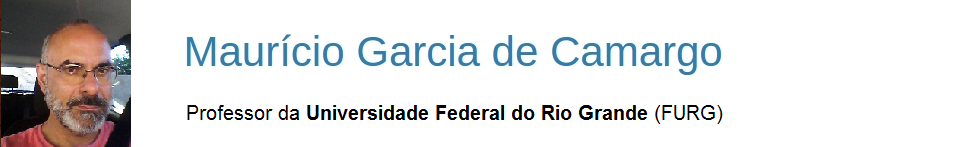

 

  

 
Prof. Maurício Garcia de Camargo - FURG.  
Este é o meu site pessoal, onde concentro todas as minhas atividades profissionais como professor e pesquisador do [Instituto de Oceanografia](http://www.io.furg.br) da [Universidade Federal do Rio Grande - FURG](http://www.furg.br), lotado no **Laboratório de Ecologia de Invertebrados Bentônicos**.
 
 
Todo o conteúdo do site é livre para uso [não comercial](https://creativecommons.org/licenses/by-nc-sa/4.0/deed.pt_BR).

----

### Disciplinas e cursos de extensão
Ministro [disciplinas](ensino.html) de estatística ambiental na graduação, na pós-graduação e eventuais [cursos de extensão](extensao.html), usando o [software R](https://mauricio-camargo.github.io/R_para_todos.html).

**Disciplinas ministradas no segundo semestre de 2018:**

- [**Análise numérica de comunidades ecológicas**](curso_comunidades_2018.html) (Oceanologia e ouvintes da pós-graduação)

- [**Estatística univariada para estudos de distribuição  espacial e temporal**](curso_univariada_2018.html)

**Mini-cursos ministrados no segundo semestre de 2018:**

- [**Mini-curso SNO**](mini-curso_SNO2018.html)
- **Mini-Curso UERGS**

<!--
-----
### Orientações em pesqisa
Oriento alunos de graduação e de pós-graduação em ecologia de comunidades bentônicas com interesse em estatística ambiental e linguagens de programação.
-->

<!--
-----
### Atividades adminstrativas
Atualmente sou coordenador substituto do curso de Oceanologia.
-->

------

### Contato 

- E-mail: [camargofurg@gmail.com](mailto:camargofurg@gmail.com)
- [**Currículo Lattes**](http://lattes.cnpq.br/6674393714532464) 
- Github: http://www.github.com/mauricio-camargo
- Facebook: https://www.facebook.com/profile.php?id=100014050901446
- Endereço: Laboratório de Invertebrados Bentônicos - Instituto de Oceanografia. Av. Itália, km 8. Campus Carreiros. Rio Grande - RS. CEP 96203-900.
- Telefone: (053) 3233-6750
