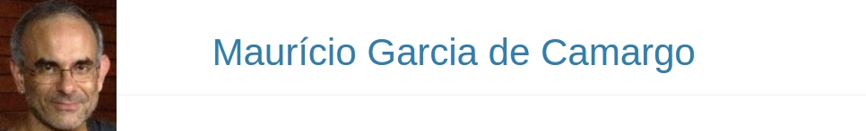

  

-----

as

### Vínculo profissional
Professor Associado da [**FURG**](http://www.furg.br), no Instituto de Oceanografia ([**IO-FURG**](http://www.io.furg.br)),  no **Laboratório de Ecologia de Invertebrados Bentônicos**.  

------

### Disciplinas e cursos de extensão
Ministro [disciplinas](ensino.html) de estatística ambiental na graduação, na pós-graduação e eventuais [cursos de extensão](extensao.html), usando o [software R](r-ecados.html).

**Disciplinas em andamento:**

- [**Estatística**](curso_estat_biol.html) (Graduação em Biologia)
- [**Análise numérica de comunidades ecológicas**](curso_comunidades.html) (Oceanologia)
- [**Ciências do ambiente**](curso_cie_amb.html) (Engenharias)
- [**Estatística univariada para estudos de distribuição espacial e temporal**](curso_univariada.html) (Diversos programas de pós-graduação)

------

### Interesses em pesquisa
Análise estatística de dados ambientais, planejamento de amostragem em ecologia, delineamentos para estudos de impacto ambiental, ecologia bêntica estuarina, de praias arenosas, de manguezais e taxonomia de poliquetas. 

Alunos de graduação ou pós-graduação que tenham aptidão para estatística e computadores e que tenham interesse em trabalhar com algum desses temas, entrem em contato. 

### Atuação na pós-graduação
Orientador de mestrado e doutorado do [Programa de Pós-graduação em Sistemas Costeiros e Oceânicos](http://www.cem.ufpr.br/?page_id=61) do [CEM-UFPR](http://www.cem.ufpr) 

------

### Contato

- E-mail: [camargofurg@gmail.com](mailto:camargofurg@gmail.com)
- [**Currículo Lattes**](http://lattes.cnpq.br/6674393714532464) 
- Github: http://www.github.com/mauricio-camargo
- Facebook: http://www.facebook.com/mauricio.camargo75
- Endereço: Laboratório de Invertebrados Bentônicos - Instituto de Oceanografia. Av. Itália, km 8. Campus Carreiros. Rio Grande - RS. CEP 96203-900.
- Telefone: (053) 3233-6750

